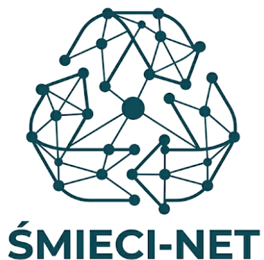

# ŚMIECI-NET

<center>

</center>

## Abstract

The project involves the development and optimization of a waste classifier for a smart trash can. A MobileNetV2 x0.75 pre-trained on the CIFAR-100 dataset was used as the base model, which was then adapted using transfer learning for a 3-class waste classification task: recyclable, bio, and electrical_waste.

The study investigated model pruning (unstructured and structured channel pruning), quantization (dynamic INT8 PTQ, static INT8 QAT FX) [4], and the optimization of the training process (data augmentation, dropout, Adam/AdamW/SGD optimizers, learning rate schedulers).

The final model combines structural pruning of 15% of the channels with quantization-aware training (QAT FX INT8) and optimal hyperparameters. It achieves a size of ~1.2 MB (compared to the 5.39 MB baseline, yielding a 4.5x compression) and an inference time of ~1.4 ms/image on a CPU (2.2x faster), while maintaining an accuracy of ~84% on noisy data

## Setup

### Environment preparation

```
uv sync
uv pip install -e . 
```

### Monitoring runs

```
uv run aim up --port 4321
```

### Running all experiments

```
./scripts/run_all_experiments
```

Also generates all tables and figures


### Building report

```
cd report && pdflatex main.tex && bibtex main && pdflatex main.tex && pdflatex main.tex 
```
